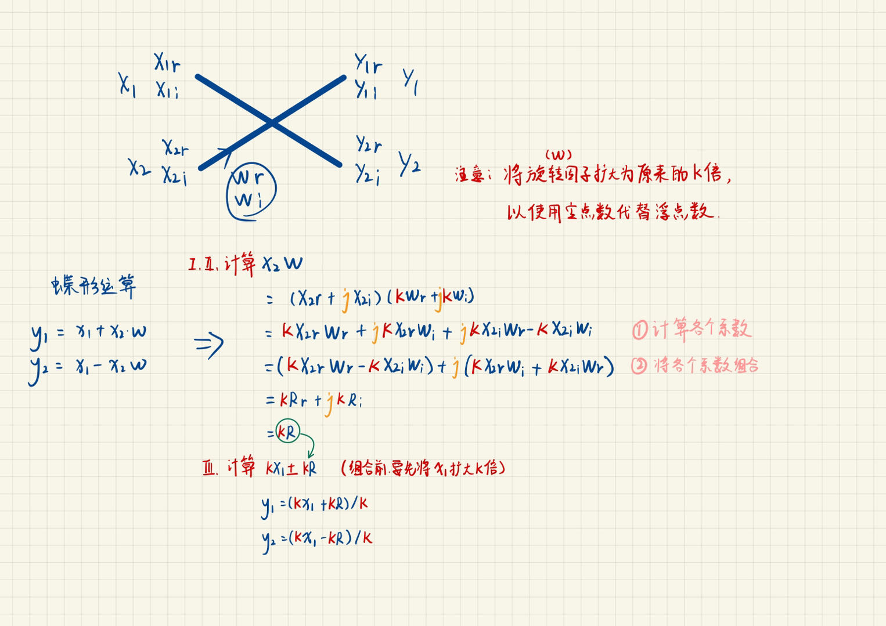
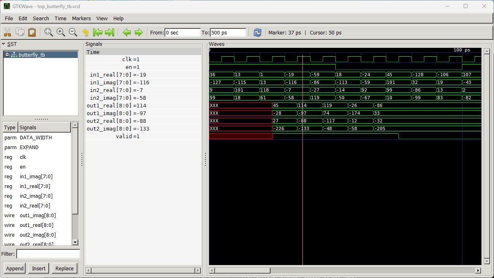
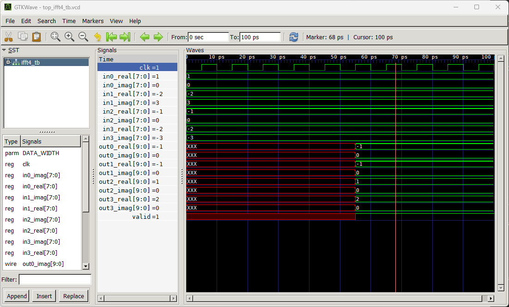

# fft_verilog
使用verilog实现FFT

代码**参考学习**自菜鸟教程的文章<Verilog 教程 7.5 Verilog FFT 设计>

原地址：https://www.runoob.com/w3cnote/verilog-fft.html

---

`script/project` 使用C实现了生成旋转因子的代码。

目前实现了可通用的Butterfly和四点的FFT/IFFT，代码也配有非常完整的注释，方便理解。

非常适合入门verilog练手。😝

。

本工程使用iverlog和modelsim通过了仿真，

---

蝶形运算模块将运算分成了三级，过程如下



…

---

​	**推荐**：如果你只是想检查Verilog文件的语法是否有错误，然后进行一些基本的时序仿真，iverilog 是一个不错的选择。相比于各大FPGA厂商的IDE几个G的大小，iverilog 极其小巧，并且支持全平台：Windows + Linux + MacOS 。

iverilog软件的下载在这里👉：https://bleyer.org/icarus/ > Download

下面这篇帖子介绍了如何使用Icarus Verilog来进行verilog文件的编译和仿真。非常简单轻便😁。

地址：https://zhuanlan.zhihu.com/p/95081329

---

至于如何使用iverilog+gtkwave仿真本工程，可参照下面的过程.

第一步：这个命令会将Verilog文件butterfly.v、ifft4.v和ifft4_tb.v编译，并生成一个名为test_ifft4的可执行文件。

```bash
iverilog -o test_ifft4 ..\butterfly.v ..\ifft4.v ..\ifft4_tb.v
```

第二步：这个命令会运行ifft4模块的testbench。

```bash
vvp test_ifft4
```

第三步：这个命令会打开波形查看器，以可视化保存在VCD文件wave_ifft4_tb.vcd中的仿真结果。

```bash
gtkwave top_ifft4_tb.vcd
```


使用Makefile可以简化命令行输入

```makefile
# Encoding: UTF-8

BUILD_DIR = build

butterfly_tb: butterfly_tb.v butterfly.v | build
	iverilog -o $(BUILD_DIR)/top_butterfly_tb $^
	vvp $(BUILD_DIR)/top_butterfly_tb

fft4_tb: fft4_tb.v fft4.v butterfly.v | build
	iverilog -o $(BUILD_DIR)/top_fft4_tb $^
	vvp $(BUILD_DIR)/top_fft4_tb

ifft4_tb: ifft4_tb.v ifft4.v butterfly.v | build
	iverilog -o $(BUILD_DIR)/top_ifft4_tb $^
	vvp $(BUILD_DIR)/top_ifft4_tb

view: butterfly_tb fft4_tb ifft4_tb
	gtkwave top_butterfly_tb.vcd
	gtkwave top_fft4_tb.vcd 
	gtkwave top_ifft4_tb.vcd

build: 
	mkdir $(BUILD_DIR)

```

编译运行

```bash
make view
```

将会依次打开`butterfly_tb` `fft4_tb` `ifft4_tb` 


**top_butterfly_tb** 



**top_ifft4_tb** 


